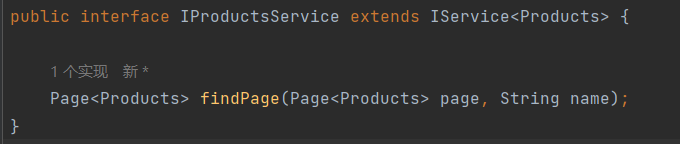
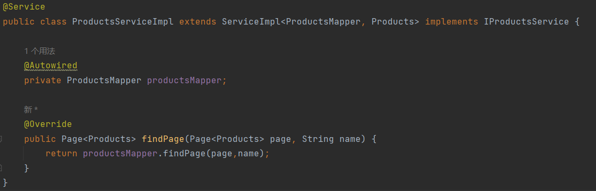
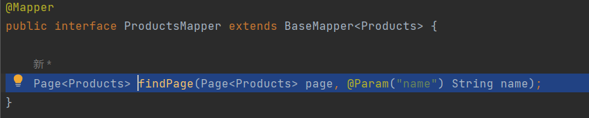
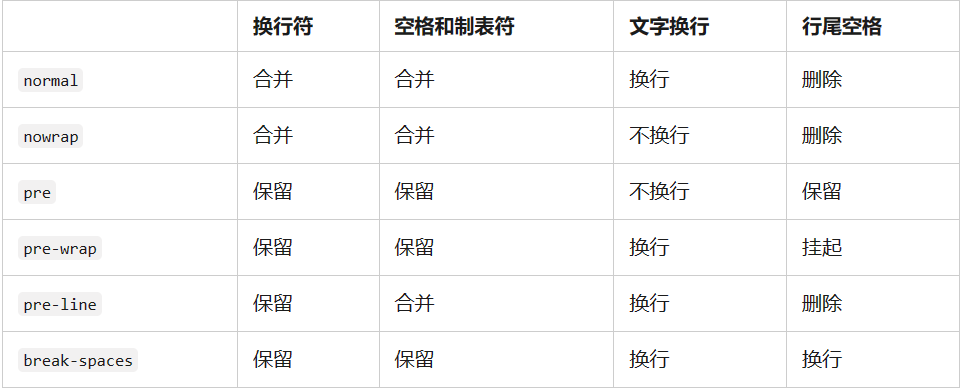

# 电商项目

## 技术栈

后端：springboot+mybatis
前端：vue2+element+vue-router


## 后台功能

- 管理员登录，带token加密

- 商品管理

  商品的增删查改，上架下架

- 订单管理（可发货）（待开发）

- 评论管理（待开发）

## 前台功能

- 普通用户登录，注册
- 首页：商品浏览，商品列表
- 商品详情
- 加购物车
- 选择数量计算价格下单
- 支付
- 订单列表（待支付，待发货，待评价，全部订单）
- 评论商品，收藏商品，点赞商品，我的收藏列表，我点赞过的商品列表（待开发）


## 数据库设计


## Record

此后记录开发过程

### 2023年5月8日15点37分

商品管理首页基本完成，但是图片上传功能还未开发。

修改增添商品页面可以按类别名称进行选择。


商品管理页的类别名称显示涉及到多表查询，下面是第一版多表查询功能：

首先需要在Products.java文件中添加以下字段：

~~~java
	@TableField(exist = false)
    private String categoryName;
~~~

让数据库忽略此条数据段，因为products表中没有此列，这是需要多表查询后在此存储数据的位置。

第一版多表查询是在ProductsController.java的分页查询函数下写入这些，最后返回page，这是每次查询一次分类表，将类别信息存储在每一个商品实体下，不推荐！

~~~java
        QueryWrapper<Products> queryWrapper= new QueryWrapper<>();
        if(!"".equals(name)){
            queryWrapper.like("name",name);
        }
        queryWrapper.orderByDesc("id");
        Page<Products> page=productsService.page(new Page<>(pageNum,pageSize),queryWrapper);
        List<Products> records=page.getRecords();
        for(Products record: records){
            Productcategories productcategories=productcategoriesService.getById(record.getProductCategoryId());
            if (productcategories!=null){
                record.setCategoryName(productcategories.getName());
            }
        }
~~~

第二版多表查询：

在ProductsController.java的分页查询函数下写入这些，调用productsService的接口函数，返回page。

~~~java
Page<Products> page=productsService.findPage(new Page<>(pageNum,pageSize),name);
~~~



进而调用具体实现类的函数，在ProductsServiceImpl.java中：



函数内部是调用mapper接口的数据库查询函数：



内容是：在ProductsMapper.xml文件中，可以在Mapper中按contorl+enter自动创建sql查询语句

~~~sql
    <select id="findPage" resultType="com.example.springboot.entity.Products">
        select products.*,productcategories.name as categoryName from products,productcategories
        <where>
            products.product_category_id=productcategories.id
            <if test="name !=null and name != ''">
                and name like concat('%',#{name},'%')
            </if>
        </where>
    </select>
~~~

但是此时的sql语句并不规范，因为如果有的商品没有类别，将查询不出来，不会返回到前端，将sql语句改成以下形式：

~~~sql
    <select id="findPage" resultType="com.example.springboot.entity.Products">
        select products.*,productcategories.name as categoryName from products
            left join productcategories
            on products.product_category_id=productcategories.id
        <where>
            <if test="name !=null and name != ''">
                and name like concat('%',#{name},'%')
            </if>
        </where>
    </select>
~~~

采用左连接的方法，没有类别商品表作为主表也能查询出来，虽然商品可能必须有类别（可以在商品表中设置类别非空）。


### 2023年6月20日21点38分

文字显示1行：

~~~css
white-space:nowrap;
overflow:hidden;
text-overflow:ellipsis
~~~

文字显示2行：

~~~css
.text-line2{
    overflow:hidden;
    text-overflow:ellipsis;
    display:-webkit-box;
    -webkit-line-clamp:2;
    -webkit-box-orient:vertical;
}
~~~


white-space:




### 2023年6月21日10点11分

#### params和query

params 只能配合 name 使用,而query用path和name都行

- 通过params传参(相当于post请求):

> 使用了params里面必须带参数,否则会报错

```vue
//编程式
this.$router.push({
name: 'home', //注意使用 params 时一定不能使用 path
params: { 
	username: this.username 
	},
})

//声明式
<router-link :to="{ name: 'home', params: { username: username } }">
    
//取值
this.$route.params.username
```

- 通过query传参(相当于get请求):

```vue
//编程式
this.$router.push({
path: '/home',
query: { 
		username: this.username 
	},
})

//声明式
<router-link :to="{ path: '/home', query: { username: username } }">
    
//取值
this.$route.query.username
```

**params 传参后，刷新页面会失去拿到的参数。所以路由参数要修改为 `'/login/:username'`（官方称为动态路由）**

```vue
const routes = [
  {
    path: '/login',
    component: Login
  },
  {
    path: '/home/:username',
    name: '/home',
    component: Home
  }
```

**但是这样就不会类似于 post 请求，他会把接收到的参数替换作为地址。**

>  假如传入参数为：params: { username: 'admin'}，那么最终访问的地址为：`http://localhost:8080/home/admin`


#### router和route

`$route` 是用来获取路由信息的，`$router`是用来操作路由的

##### $router对象

route是路由信息对象，里面主要包含路由的一些基本信息，包含当前的路径，参数，query对象等。(包括name、meta、path、hash、query、params、fullPath、matched、redirectedFrom)

**route object 出现在多个地方:**
1.组件内的 this.route和route watcher 回调（监测变化处理）;
2.router.match(location) 的返回值
3.scrollBehavior 方法的参数
4.导航钩子的参数：

```vue
**1.$route.path**
      字符串，对应当前路由的路径，总是解析为绝对路径，如 "/foo/bar"。
**2.$route.params**
      一个 key/value 对象，包含了 动态片段 和 全匹配片段，
      如果没有路由参数，就是一个空对象。
**3.$route.query**
      一个 key/value 对象，表示 URL 查询参数。
      例如，对于路径 /foo?user=1，则有 $route.query.user == 1，
      如果没有查询参数，则是个空对象。
**4.$route.hash**
      当前路由的 hash 值 (不带 #) ，如果没有 hash 值，则为空字符串。锚点
**5.$route.fullPath**
      完成解析后的 URL，包含查询参数和 hash 的完整路径。
**6.$route.matched**
      数组，包含当前匹配的路径中所包含的所有片段所对应的配置参数对象。
**7.$route.name    当前路径名字**

**8.$route.meta  路由元信息**
```

##### $router对象

>  $router对象是全局路由的实例，是router构造方法的实例,包含了一些路由的跳转方法，钩子函数等

**路由实例方法：**

1. push

```vue
// 字符串
      this.$router.push('home')
// 对象
      this.$router.push({ path: 'home' })
// 命名的路由
      this.$router.push({ name: 'user', params: { userId: 123 }})
// 带查询参数，变成 /register?plan=123
      this.$router.push({ path: 'register', query: { plan: '123' }})
push方法其实和是等同的。
```

注意：push方法的跳转会向 history 栈添加一个新的记录，当我们点击浏览器的返回按钮时可以看到之前的页面。

2. go

```vue
// 页面路由跳转 前进或者后退
this.$router.go(-1) // 后退
```

3. replace

`push`方法会向 history 栈添加一个新的记录;而`replace`方法是替换当前的页面
不会向 history 栈添加一个新的记录

```vue
// 一般使用replace来做404页面
this.$router.replace('/')
```

**注 : 配置路由时path有时候会加 '/' 有时候不加,以'/'开头的会被当作根路径，就不会一直嵌套之前的路径。**


### flex弹性布局

参考链接:

[Flex 布局语法教程 | 菜鸟教程 (runoob.com)](https://www.runoob.com/w3cnote/flex-grammar.html)
